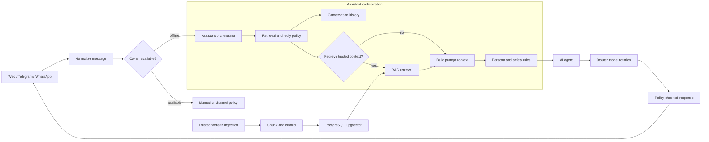

# Xiaopuy AI plan

Dokumen ini adalah rujukan utama untuk menjaga pengembangan Xiaopuy AI tetap
berlapis, aman, dan sesuai tujuan produk: asisten percakapan yang dapat mewakili
pemilik saat ia tidak tersedia, sekaligus menjawab pertanyaan klien dari
pengetahuan tepercaya tentang `aryakun.id`.

## Prinsip yang tidak berubah

- Channel hanya menerima, menormalkan, dan mengirim pesan; tidak berisi logika
  RAG, persona, atau pemilihan model.
- Assistant orchestrator menentukan kebijakan. Provider AI hanya menghasilkan
  respons melalui abstraksi `internal/ai` dan `internal/router9`.
- Persona menentukan gaya dan batas perilaku; RAG hanya menyediakan fakta
  referensi. Isi hasil retrieval tidak pernah menjadi instruksi sistem.
- Riwayat percakapan dan memori jangka panjang adalah data yang berbeda.
  Fakta permanen hanya disimpan lewat kebijakan eksplisit.
- Tindakan dengan dampak eksternal memerlukan otorisasi dan pemeriksaan
  kebijakan sebelum dieksekusi.
- Model embedding dan skema pgvector diperlakukan sebagai satu kontrak. Dimensi
  aktif adalah 4096 dan perubahan memerlukan migrasi serta re-indexing terencana.

## Flow target

Kondisi owner menentukan apakah respons otomatis boleh dibuat. Ia tidak boleh
mengubah persona, RAG, atau aturan otorisasi. Respons otomatis juga tidak boleh
mengklaim sebagai pesan yang dikirim langsung oleh pemilik kecuali perilaku itu
ditetapkan secara eksplisit.

## Kondisi saat ini

Fondasi berikut sudah tersedia:

- Abstraksi provider chat dan embedding melalui 9router.
- Persona pemilik dan klien, percakapan, persistence PostgreSQL, serta endpoint
  chat dasar.
- RAG dengan chunking, hashing dokumen, pencarian cosine pgvector, ambang
  relevansi awal 0.75, dan limit retrieval awal 5.
- Crawler website yang dibatasi domain, kedalaman, jumlah halaman, ukuran respons,
  dan waktu fetch.
- Endpoint ingest `POST /v1/ingest/crawl`, yang aktif hanya bila PostgreSQL,
  `ROUTER9_EMBEDDING_MODEL`, dan `INGEST_ALLOWED_DOMAINS` dikonfigurasi.
- Startup idempoten untuk skema percakapan dan RAG/pgvector, termasuk pemeriksaan
  embedding berdimensi 4096 saat indexing maupun retrieval.

Paket assistant, RAG, chat, presence, dan channel harus tetap terpisah. Endpoint
chat yang sudah ada adalah fondasi transport; penggabungan penuh ke assistant
orchestrator dilakukan sebagai milestone berikutnya.

## Alur knowledge ingestion

1. Operator memanggil endpoint crawl dengan URL seed yang berada dalam daftar
   domain tepercaya.
2. Ingestion service menerapkan batas operasional lalu crawler mengambil halaman
   HTML atau teks yang didukung.
3. Parser menghasilkan dokumen berisi URL, judul, konten, tipe, dan tingkat trust.
4. RAG service membandingkan hash konten; dokumen yang tidak berubah tidak di-embed
   ulang.
5. Konten berubah di-chunk, di-embed dengan model yang dikonfigurasi, lalu disimpan
   ke `rag_documents` dan `rag_chunks`.
6. Saat digunakan oleh orchestrator, hanya hasil dengan relevansi cukup yang masuk
   ke konteks respons sebagai bahan referensi.

Dokumen hasil crawl adalah data tidak tepercaya. Teks di dalamnya tidak dapat
mengubah sistem, persona, izin, identitas, atau instruksi tool.

## Milestone pelaksanaan

| Urutan | Fokus | Hasil yang harus ada | Kriteria penerimaan |
| --- | --- | --- | --- |
| 1 | Satukan orchestration | Server chat memanggil assistant orchestrator, bukan langsung generation layer | Riwayat, policy, persona, dan error handling tetap teruji |
| 2 | Aktifkan RAG pada respons | Retrieval policy menentukan kapan query embedding dan context dilakukan | Salam singkat tidak melakukan retrieval; konteks dibatasi dan skor di bawah ambang tidak digunakan |
| 3 | Perkuat knowledge ingestion | Operasional crawl teramati dan dokumen sumber dapat ditinjau | Hanya domain allowlist diproses; crawl gagal tidak menulis data parsial |
| 4 | Kebijakan memori | Tetapkan aturan baca/tulis memori jangka panjang dan persetujuan pemilik | Pesan biasa tidak otomatis menjadi memori permanen |
| 5 | Tool dan action layer | Tool memiliki kontrak, otorisasi, audit trail, dan batas side effect | Tidak ada aksi eksternal tanpa policy check |
| 6 | Presence dan offline response | Presence menentukan channel policy sebelum generation | Asisten tidak merespons otomatis saat pemilik tersedia tanpa aturan eksplisit |
| 7 | Channel adapters | Tambahkan Telegram lalu WhatsApp sebagai adapter tipis | Pesan dinormalisasi ke kontrak yang sama; logika AI tidak diduplikasi |
| 8 | Production hardening | Observability, timeout, retry, rate limit, dan audit keamanan | Kegagalan provider atau storage terukur dan tidak membocorkan secret |

Milestone dikerjakan berurutan. Perubahan channel tidak boleh mendahului
stabilisasi orchestration, RAG, dan policy inti.

## Konfigurasi operasional

| Variabel | Diperlukan untuk | Catatan |
| --- | --- | --- |
| `HTTP_ADDR` | HTTP server | Default `:8080` |
| `ROUTER9_BASE_URL` | Chat dan embedding | Endpoint 9router kompatibel OpenAI |
| `ROUTER9_API_KEY` | Provider terproteksi | Jangan commit nilainya |
| `ROUTER9_MODEL` | Chat generation | Model dapat dirotasi oleh 9router |
| `ROUTER9_EMBEDDING_MODEL` | RAG ingestion/retrieval | Target saat ini `openrouter/qwen/qwen3-embedding-8b` |
| `DATABASE_URL` | Persistence dan RAG | PostgreSQL dengan ekstensi pgvector |
| `INGEST_ALLOWED_DOMAINS` | Website crawl | Daftar domain dipisahkan koma dan hanya berisi sumber tepercaya |

Endpoint ingestion tidak diaktifkan bila konfigurasi database, model embedding,
atau allowlist domain belum lengkap. Ini mencegah penyimpanan knowledge tanpa
vector store dan mencegah crawler digunakan pada host sembarang.

## Aturan perubahan

Sebelum memulai feature baru, pastikan pemilik tanggung jawabnya jelas:

- `internal/ai`: model-facing abstractions, persona, dan context assembly.
- `internal/assistant`: orchestration dan decision policy.
- `internal/rag`: retrieval, chunking, dan context referensi.
- `internal/storage/postgres`: persistence serta pgvector.
- `internal/embedding`: kontrak embedding.
- `internal/router9`: adapter 9router dan model rotation.
- `internal/chat`, `internal/presence`, dan channel adapter: state dan delivery.

Setiap perubahan interface harus memperbarui seluruh implementasi, caller, mock,
dan test. Perubahan schema atau model embedding harus mencantumkan kompatibilitas,
migrasi, dan rencana re-indexing.

## Definition of done

Sebuah milestone selesai bila:

- Flow dan batas paket tetap mengikuti dokumen ini.
- Perilaku baru memiliki test deterministik di lapisan yang tepat.
- Input eksternal, dokumen RAG, dan output tool diperlakukan sebagai tidak tepercaya.
- Konfigurasi dan dokumentasi diperbarui tanpa memasukkan secret.
- `go test ./...`, `go vet ./...`, dan `go build ./...` berhasil dijalankan.
